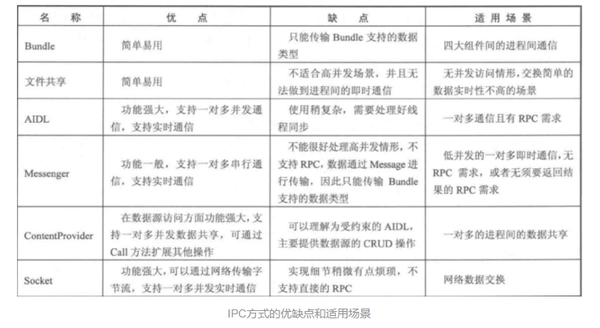
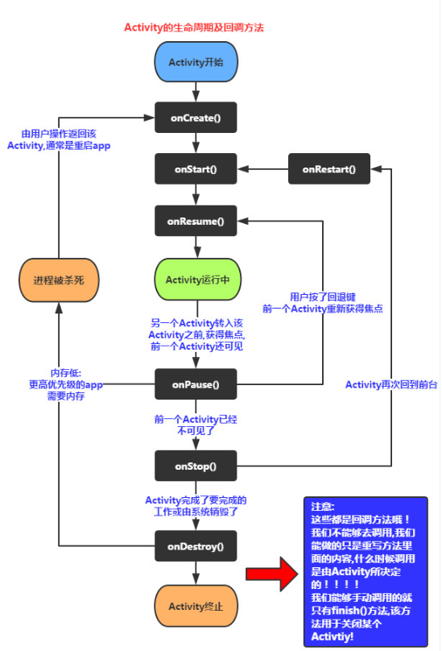

# 阅读笔记   

[TOC]

---

### Java程序运行机制

&emsp;&emsp;先对Java程序的运行机制做一个概述.Java程序是运行在Java虚拟机(JVM),上而不是直接运行在设备上的.JVM大致的模型如下:  

&emsp;&emsp;首先程序编译生成的.class文件经过Class Loader加载（负责对数据进行校验和初始化），然后再在Runtime Data Area开辟程序运行时所需要的内存区域（包括堆栈内存、函数区内存、常量区、程序固定内存等等，部分为线程共享），对数据管理。分配完内存后就是通过java虚拟机进行解释执行，并通过native library与其他编程语言交互。  

---

### 程序的并发机制

&emsp;&emsp;所谓并发，一般都是与并行相对来讲的，通俗来说。并发是指多任务以时间片轮转的形式有序执行等，从而导致宏观上像是多任务同时进行（并行）。并发机制一般表现为**多线程**或**多进程**的形式。而对于这种多任务并发的形式，首先要分析多任务之间如何交流。  

---

#### 多线程及其之间通信  
&emsp;&emsp;对于多进程而言,得提到上面讲过的JVM中的内存区的管理，Java虚拟机内存模型（JMM）如下图：  

&emsp;&emsp;其中主存区中的堆内存和函数区的内存都是线程共享的，而每个线程也拥有自己独立的堆栈内存。  

&emsp;&emsp;所谓线程共享，即每个子线程都会在自身的堆栈内存中为共享区域的内存保留一份copy，然后单独操作自己的copy。若要实现对共享内存区的共同维护，则需要通过Synchronized同步锁或者Lock锁对象**(安全)**或者对共享变量添加volatile关键字**（不安全）**的方式实现。  

&emsp;&emsp;举个例子，代码如下，当线程A执行`Market m = new Market();	m.buy();`后，线程B读取goods值为4，原因是二者维护的是同一块内存区域（位于主存的变量goods）。如果按注释那样去掉volatile关键字，A线程再进行同样的操作，B线程获取到的goods值却可能为5。原因正是AB两个线程这个时候维护的是各自对主存这块区域的copy，所以互不影响。  

```java
public class Market{
    // public int goods = 5;
    public volatile int goods = 5;
    public void buy(){
        this.goods--;
    }
}
```

&emsp;&emsp;但是这里常常有一个误区，那就是关于volatile关键字与Synchronized同步锁机制的区别。volatile修饰的变量是**不具有原子性**的，而且也不能保证线程同步，只能保证对内存区域的修改对于其他线程可见。  

&emsp;&emsp;所谓原子性，是指对多个操作要么都执行，要么都不执行，所以单个的原子操作没有必要通过 synchronized做线程同步。（但是多个就有必要）  

也就是当多个线程同时对volatile进行修改操作后，所得的值会与预计中的有差异。但Synchronized同步锁会使多线程对同一内存区域的读取具有同步性，从而实现原子性的操作。就好比很多人都有钥匙，但只能一个一个地开锁进去。使用Synchronized同步锁的实例如下（生产者消费者的例子）：  

&emsp;&emsp;关于线程间具体的通信，还需要用到`wait()`跟`notify()`配合的线程等待和唤醒机制，但这种方式下notify不能唤醒指定的线程，所以一般都使用Lock绑定多个condition监视，然后通过condition对象来使指定的线程等待或唤醒。  

&emsp;&emsp;Lock锁的使用实例如下，  

---

#### 线程池的原理和搭建

&emsp;&emsp;所谓线程池，通俗来说就是容放多个线程的空间，线程池内的线程并发执行多个任务。当有任务需要执行时，线程池会派出一个线程去执行。当线程执行完任务后就会回到线程池等待分配新的任务而不是立刻销毁。直到线程池所有线程都被使用，多余的任务就会进入等待队列等待，直到线程池出现新的闲置的线程。

##### 源码分析

&emsp;&emsp;有关线程池的类与接口的关系可参考下图：
​	
//executor\executorservice等等关系图
​	
&emsp;&emsp;Java中通过`Executors`提供4种线程池的创建，分别如下：

- `Executors.newCachedThreadPool()`提供一个线程数量不固定的线程池（最多2147483647个线程，Integer的最大值,可视为无限数量），线程池内的线程回收后的60s内可执行其它任务，若闲置时间超过60s就会自动销毁。返回类型为`ExecutorService`（实际为`ThreadPoolExecutor`对象的向上转型）。  

- `Executors.newFixedThreadPool()` 提供一个线程数量固定的线程池，执行完任务的线程不会销毁，在线程池中等待。线程数量通过参数指定，返回对象类型为`ExecutorService`（也为`ThreadPoolExecutor`对象的向上转型）。


- `Executors.newScheduledThreadPool()`提供一个线程数量固定的线程池，与上一个类型的线程池相比，这个线程池能够定时地启动			返回对象类型为`ScheduledExecutorService`（实际为`ScheduledThreadPoolExecutor`）。   

- `Executors.newSingleThreadExecutor()`提供一个单线程化的线程池，它只会用唯一的工作线程来执行任务，保证所有任务按照指定顺序(FIFO, LIFO, 优先级)执行 。返回对象类型为`ExecutorService`（ 实际为`ThreadPoolExecutor`）。   


&emsp;&emsp;Java中线程池的搭建离不开`ThreadPoolExecutor`类，`ThreadPoolExecutor`类是继承自`AbstractExecutorService`抽象类,该类实现了`Executor`、`ExecutorService`接口,`Executor`接口内只有`void execute(Runnable command)`接口函数，抽象了具体的任务执行过程。

&emsp;&emsp;由于`ExcutorService()`内部抽象函数比较多，挑几个主要的讲。`submit()`接口抽象了任务的执行提交过程，与`execute()`方法相似而又不同的是，该方法返回了一个`Future`对象来表示任务执行的结果，`Future`类提供有`cancel()`函数能够取消掉执行中的任务（前提是任务还未执行完毕）。
​	
//线程池的搭建

---

### Android 分析  

#### Android系统架构分析  

&emsp;&emsp;Android架构主要分为四部分，从底层到顶层依次为**Linux Kernel**(内核层)，**Libraries**(共享库，以及android运行时库，**Android Runtime**)，**Application Framework**(应用框架层)，**Application**(应用程序),重点研究的源码也集中于Framework层。  

&emsp;&emsp;首先对这4个部分作个简单的介绍：

- 其中Application主要指的是系统应用，如桌面、闹钟、文件管理、设置、日历、电话、短信等。

- Application Framework,为App程序提供各种API，是应用程序的框架，为应用程序提供各种组建和服务，由于上层的应用程序是以JAVA构建的，因此本层次提供了以下服务：  

   //1. 丰富而又可扩展的视图(Views)，可以用来构建应用程序， 它包括列表(lists)，网格(grids)，文本框(text boxes)，按钮(buttons)， 甚至可嵌入的web浏览器；
   2. 内容提供器(Content Providers)使得应用程序可以访问另一个应用程序的数据(如联系人数据库)，或者共享它们自己的数据；
   3. 资源管理器(Resource Manager)提供非代码资源的访问，如本地字符串，图形，和布局文件( layout files )；
   4. 通知管理器 (Notification Manager) 使得应用程序可以在状态栏中显示自定义的提示信息；


- Android Runtime为一个包含了Java语言核心库大多数功能的库，主要承担了动态编译、解释执行dalvik格式的字节码这一jvm角色，每个应用的进程对应了自己的独立的Runtime实例。Dalvik虚拟机执行Dalvik可执行文件(.dex)，该格式文件针对小内存使用做了优化。同时虚拟机是基于寄存器的，所有的类都经由JAVA编译器编译，然后通过SDK中 的 “dx” 工具转化成.dex格式由虚拟机执行。Dalvik虚拟机依赖于linux内核的一些功能，比如线程机制和底层内存管理机制。

- Libraries为一些C/C++开源库，以下是其中一些核心库：
   1. 系统 C 库 (libc)：一个从 BSD 继承来的标准 C 系统函数库( libc )， 它是专门为基于 embedded linux 的设备定制的。
   2. 媒体库 (media framework)：基于 PacketVideo OpenCORE。该库负责支持多种常用的音频、视频格式回放和录制，同时支持静态图像文件。例如MPEG4，H.264，MP3，AAC，AMR，JPG，PNG等格式的文件。
   3. Surface Manager：对显示子系统的管理，并且为多个应用程序提供了2D和3D图层的无缝融合。
   4. LibWebCore：一个最新的web浏览器引擎，用于支持Android浏览器和一个可嵌入的web视图。
   5. web引擎  (webkit)，该函数库负责 android网页浏览器的运行。
   6. SGL/OpenGl ES：底层的2D/3D图形引擎,常用于游戏开发。
   7. FreeType：位图(bitmap)和矢量(vector)字体显示。
   8. SQLite：一个对于所有应用程序可用，功能强劲的轻型关系型数据库引擎。  

- Linux Kernel包含Android的核心系统服务，如安全性，内存管理，进程管理， 网络协议栈和驱动模型。 Linux 内核也同时作为硬件和软件栈之间的抽象层。

---

#### Framework层分析
&emsp;&emsp;Android FrameWork主要分为以下3个部分内容：服务端、客户端、Linxu驱动。

   1. 服务端包含两个重要的服务类，WindowManagerService（WMS）和ActivityManagerService（AMS）,以及其他的服务管理类。下面是对这些服务类的介绍：
   - WindowManagerService，窗口管理服务，包括动画处理 ，Input分发、处理，Display管理（多屏显示，窗口显示、层序、隐藏）。
   - ActivityManagerService， 负责四大组件的生命周期的调度和管理，同时设计一些些window、电源、权限等内容。
   - PackageManagerService，程序包管理服务
   - PowerManagerService， 电源管理服务
   - BatteryService，电池管理服务
   - NetworkManagerService，网络管理服务
   - BluetoothService，蓝牙管理服务
   - InputMethodManagerService，输入法管理服务
   - LightService，自然光强度感应传感器服务
   - VibratorService，手机震动传感器服务
   - ClipboardService，剪切板服务
   - StatusBarManagerService，状态栏管理服务
   - 还有其他很多服务，不一一概述。
2. 其它主要类
3. Linux驱动：主要为SurfaceFlingger和Binder。SurfaceFlingger是将每个Surface显示到一个屏幕，Binder是负责进程间信息的传递，下面会提到。
在Android应用层中，程序执行的入口是ActivityThread.java里的main函数，

---

#### 多进程及IPC（Inter-Process Communication ）

&emsp;&emsp;对于多进程，一开始我还是感到很陌生，印象仅仅停留在大学时接触到的Socket编程的阶段，对于android的多进程编程也没有太多的关注。通过这几天的学习了解总结一下。  

&emsp;&emsp;首先关于android应用中使用多进程的常见场景，由于android系统对于每个进程分配的资源有限，所以单进程有些应用容易出现OOM（out-of-memory）报错，这时常使用多进程用以分担主进程压力。
​	
&emsp;&emsp;在多进程模式中，常常会出现如下问题：  

- 静态成员与单例模式失效

- 线程同步完全失效

- SharedPreferences使用异常

- Application创建多次

&emsp;&emsp;其实这些问题的根本原因是不同的进程运行在不同的虚拟机上，这样每个进程的内存空间也就不同，也就是**内存不共享**。每个进程中都保留副本（类似多线程），这样静态成员和线程同步也就失效；由于android对于SharedPreferences的读写会保留缓存，这样多进程也就会导致多份缓存发生冲突；而且每个进程启动时，由于分配了独立的虚拟机，所以应用会又启动一次。  

&emsp;&emsp;为了避免这些问题，常常采用多种IPC机制，如AIDL、Messenger、Bundle、Socket等等。这些IPC机制的原理是基于Binder机制实现的,如图为这些IPC机制的特点和应用的场景：  



​	

&emsp;&emsp;所谓Binder机制，主要包含Client、Server、ServerManager三个对象，Binder的机制使用到了Proxy代理模式，对于代理模式不做细述。

&emsp;&emsp;对于Binder,可以理解为一种IPC机制，不过Binder还可以理解为一种虚拟的物理设备，设备驱动为/dev/binder,在linux中没有这种通信方式。在Framework层中，Binder是ServiceManager连接其它Manager和其它ServiceManager的桥梁，在应用层，Binder用于客户端和服务端通信。  

&emsp;&emsp;在android中，Binder类继承IBinder接口，  

&emsp;&emsp;实际应用中常用的IPC机制有AIDL，Messenger等，下面主要讲一下AIDL机制的使用。  

#### AIDL机制的实例

&emsp;&emsp;首先由于进程间通信的数据可能是一个自定义类的对象，这时候就需要将对象序列化后再传输，在AIDL机制中，并不支持自定义类型的数据，但是支持Parcel类型,Parcel类型与Parcelable类型（一种经过）对应，是用于表示一个管道。所以这时一般对自定义对象进行序列化。关于序列化，java中是通过实现Serializable接口来序列化的，而在安卓中，提供了一种更高效，内存开销更少的Parcelabel接口来实现序列化。Parcelable接口需要实现`describeContents()` ，`writeToParcel(Parcel dest, int flags)` 方法，并实例化静态内部接口`Parcelable.Creator` ，Parcelable接口源码（已去掉部分无用注释）如下：  

```java
package android.os;
import android.annotation.IntDef;
import java.lang.annotation.Retention;
import java.lang.annotation.RetentionPolicy;
/**
 * <p>A typical implementation of Parcelable is:</p>
 * 
 * <pre>
 * public class MyParcelable implements Parcelable {
 *     private int mData;
 *
 *     public int describeContents() {
 *         return 0;
 *     }
 *
 *     public void writeToParcel(Parcel out, int flags) {
 *         out.writeInt(mData);
 *     }
 *
 *     public static final Parcelable.Creator&lt;MyParcelable&gt; CREATOR
 *             = new Parcelable.Creator&lt;MyParcelable&gt;() {
 *         public MyParcelable createFromParcel(Parcel in) {
 *             return new MyParcelable(in);
 *         }
 *
 *         public MyParcelable[] newArray(int size) {
 *             return new MyParcelable[size];
 *         }
 *     };
 *     
 *     private MyParcelable(Parcel in) {
 *         mData = in.readInt();
 *     }
 * }</pre>
 */
public interface Parcelable {
    /** @hide */
    @IntDef(flag = true, prefix = { "PARCELABLE_" }, value = {
            PARCELABLE_WRITE_RETURN_VALUE,
            PARCELABLE_ELIDE_DUPLICATES,
    })
    @Retention(RetentionPolicy.SOURCE)
    public @interface WriteFlags {}
    /**
     * Flag for use with {@link #writeToParcel}: the object being written
     * is a return value, that is the result of a function such as
     * "<code>Parcelable someFunction()</code>",
     * "<code>void someFunction(out Parcelable)</code>", or
     * "<code>void someFunction(inout Parcelable)</code>".  Some implementations
     * may want to release resources at this point.
     */
    public static final int PARCELABLE_WRITE_RETURN_VALUE = 0x0001;
    /**
     * Flag for use with {@link #writeToParcel}: a parent object will take
     * care of managing duplicate state/data that is nominally replicated
     * across its inner data members.  This flag instructs the inner data
     * types to omit that data during marshaling.  Exact behavior may vary
     * on a case by case basis.
     * @hide
     */
    public static final int PARCELABLE_ELIDE_DUPLICATES = 0x0002;
    /*
     * Bit masks for use with {@link #describeContents}: each bit represents a
     * kind of object considered to have potential special significance when
     * marshalled.
     */
    /** @hide */
    @IntDef(flag = true, prefix = { "CONTENTS_" }, value = {
            CONTENTS_FILE_DESCRIPTOR,
    })
    @Retention(RetentionPolicy.SOURCE)
    public @interface ContentsFlags {}
    /**
     * Descriptor bit used with {@link #describeContents()}: indicates that
     * the Parcelable object's flattened representation includes a file descriptor.
     *
     * @see #describeContents()
     */
    public static final int CONTENTS_FILE_DESCRIPTOR = 0x0001;
    
    /**
     * Describe the kinds of special objects contained in this Parcelable
     * instance's marshaled representation. For example, if the object will
     * include a file descriptor in the output of {@link #writeToParcel(Parcel, int)},
     * the return value of this method must include the
     * {@link #CONTENTS_FILE_DESCRIPTOR} bit.
     *  
     * @return a bitmask indicating the set of special object types marshaled
     * by this Parcelable object instance.
     */
    public @ContentsFlags int describeContents();
    
    /**
     * Flatten this object in to a Parcel.
     * 
     * @param dest The Parcel in which the object should be written.
     * @param flags Additional flags about how the object should be written.
     * May be 0 or {@link #PARCELABLE_WRITE_RETURN_VALUE}.
     */
    public void writeToParcel(Parcel dest, @WriteFlags int flags);
    /**
     * Interface that must be implemented and provided as a public CREATOR
     * field that generates instances of your Parcelable class from a Parcel.
     */
    public interface Creator<T> {
        /**
         * Create a new instance of the Parcelable class, instantiating it
         * from the given Parcel whose data had previously been written by
         * {@link Parcelable#writeToParcel Parcelable.writeToParcel()}.
         * 
         * @param source The Parcel to read the object's data from.
         * @return Returns a new instance of the Parcelable class.
         */
        public T createFromParcel(Parcel source);
        
        /**
         * Create a new array of the Parcelable class.
         * 
         * @param size Size of the array.
         * @return Returns an array of the Parcelable class, with every entry
         * initialized to null.
         */
        public T[] newArray(int size);
    }
    /**
     * Specialization of {@link Creator} that allows you to receive the
     * ClassLoader the object is being created in.
     */
    public interface ClassLoaderCreator<T> extends Creator<T> {
        /**
         * Create a new instance of the Parcelable class, instantiating it
         * from the given Parcel whose data had previously been written by
         * {@link Parcelable#writeToParcel Parcelable.writeToParcel()} and
         * using the given ClassLoader.
         *
         * @param source The Parcel to read the object's data from.
         * @param loader The ClassLoader that this object is being created in.
         * @return Returns a new instance of the Parcelable class.
         */
        public T createFromParcel(Parcel source, ClassLoader loader);
    }
}
```

&emsp;&emsp;其中`describeContent()`方法用于描述特别的序列化对象，`writeToParcel()`方法用于将对象写入Parcel对象中，这里**对成员变量的写入顺序必须与后面的读取顺序相一致**。`Creator<T>`接口内部的抽象函数`createFromParcel()`函数用于从Parcel对象读取数据，`newArray(int size)`用于外部类序列化自身的数组对象。  

&emsp;&emsp;在使用AIDL机制的时候，需要将自定义的数据类型序列化，。  

---

####  Android Activity/Fragment启动生命周期

&emsp;&emsp;activity的生命周期如下图所示，在activity生成时系统会执行activity的`onCreate()`函数，；当activity在屏幕上可见（即便被遮住部分或不能与用户交互）时会调用`onStart()`/`onRestart()`方法；而当activity位于前台，即显示activity的栈的栈顶，则会调用`onResume()`方法（对比`onStart()`）。  



&emsp;&emsp;对于`onPause()`（没有位于前台时调用）,`onStop()`（不可见、隐藏于后台时调用）,`onDestroy()`（activity资源释放时调用）方法，分别与`onResume()`, `onStart()`, `onDestroy()`方法对应构成三个周期：  

1. **整个activity的生命周期**，从`onCreate()`到`onDestroy()`,activity从创建到释放的过程。
2. **activity页面的可见周期**，从`onStart()`/`onRestart()`到`onStop()`，activity在屏幕上显示的过程。
3. **activity位于前台的周期**，从`onResume()`到`onPause()`，activity位于最前端能与用户交互的过程。

&emsp;&emsp;上面这些是对activity生命周期的一个基本介绍，具体分析源码，首先是`onCreate()`函数，在这个函数内，activity一般完成布局和变量的初始化,而观察会发先该函数还有一个`Bundle`类型的参数`savedInstanceState`，顾名思义，它是用来保存activity的状态的，在`Activity.onCreate()`执行时会被用来恢复之前activity的状态（如果`savedInstanceState`不为空，则代表有保存之前的状态，判断是否根据该状态恢复）。同时会据此确定 `mAutoFillResetNeeded`这一变量的值，在`Activity.onStart()`函数中根据该变量的值确定自动填充。在`Activity.onResume()`方法中，恢复了视图，所以一般在该方法中实现一些动画效果，或者打开相机或其它独占性的设备。`Activity.onPause()`方法内部没有太多操作，该方法一般用于实现保存一些持久化的对象。`Activity.onStop()`方法根据`mAutoFillResetNeeded`这一变量隐藏页面。`Activity.onDestroy()`执行时，会先根据`isFinishing()`方法来区分是因为调用`finish()`方法还是因为内存不足而被系统销毁，然后对activity做最后的清理。  

##### 关于onSaveInstancestate()以及onRestoreInstanceState()的调用时机的问题

&emsp;&emsp;onSaveInstantState()用于在onStop()前保存activity的状态。因为android的activity当不在屏幕显示时，有可能会被系统回收，所以应该在此时保存。  

&emsp;&emsp;而onRestoreInstanceState()稍微有点不同，该方法只会在**activity确实被系统回收然后重新创建activity时调用**，即只会在onStart()后调用，而不会在onRestart()后调用。

##### 关于横竖屏切换时生命周期的调用问题
&emsp;&emsp;横竖屏切换的生命周期调用视AndroidManifest.xml中的android:configChange而定。  

- 如果不设置configChange，切屏会重新调用生命周期（onPause->onStop->onDestroy->onCreate->onStart->onResume.......），竖屏切为横屏会调用**1**次，横屏切为竖屏会调用**2**次。

- 如果configChange = "orientation",切横/竖屏时会调用**1**次生命周期

- 如果configChange = "orientation|keyboardHidden|screenSize"，切屏不会重新调用生命周期，只会执行onConfigurationChange方法。  

&emsp;&emsp;其中，orientation代表横竖屏切换，screenSize代表屏幕大小发生了改变。 除此之外，**不同品牌的手机切屏也会有不同的反应**。当然，一般大多数activity直接在AndroidManifest中的android:screenOrientation属性指明是横屏(landscape)还是竖屏(portrait)。


#### Activity启动模式

&emsp;&emsp;Activity的启动模式(android:launchMode)分为4种：Standard, SingleTop, SingleTask, SingleInstance。  

- 在**Standard**模式下，每次创建Activity实例，都会入栈成为栈顶，即便是相同类型的Activity。  

- 在**SingleTop**模式下，与Standard模式稍有不同，若栈顶的Activity类型与即将创建的Activity的类型相同，则直接复用栈顶的Activity，而不会创建新的Activity。若要创建的Activity与栈顶的类型不同，就会新建该Activity并放在栈顶。这种模式下，直接复用不会调用`onCreate()`,`onStart()`方法，但会回调`onNewIntent()`方法。  

- 在**SingleTask**模式下，若栈内有与需要创建的Activity同一类型，则不会创建新的Activity，并将存在栈中的Activity上面的所有其他Activity销毁，使它成为栈顶。   

- 在**SingleInstance**模式下，整个手机系统只能有某类型的Activity的一个实例，并且其他应用打开这类activity时共享同一个该activity。  

&emsp;&emsp;Standard模式用于绝大多数的activity；SingleTop模式一般用于消息页面和浏览器书签页面，不同的消息都展示在同一页面，而不是通过不同的页面来切换，并且能一次性返回到上一页面而不需要连续返回多次；SingleTask模式一般用于app的初始页面，当需要返回到主页面时，直接将主页面之后打开的页面destroy掉；SingleInstance模式一般用于启动其他应用的页面（例如闹钟和闹钟的设置页面以及从某app打开地图）。  


#### View的手势事件流程分析

&emsp;&emsp;对于在手机屏幕上的任何手势操作，android都以MotionEvent对象的形式进行分解，对于手势操作，MotionEvent分为几种事件类型：  
1. ACTION_DOWN：手指刚接触屏幕，按下去的那一瞬间产生该事件。
2. ACTION_MOVE：手指在屏幕上移动时候产生该事件。
3. ACTION_UP：手指从屏幕上松开的瞬间产生该事件。
4. ACTION_CANCEL：根据官方文档说明，它与ACTION_UP的区别在于它不接收抬手的坐标信息。一般来说，如果一个子视图接收了父视图分发给它的ACTION_DOWN事件，那么与ACTION_DOWN事件相关的事件流就都要分发给这个子视图，但是如果父视图希望拦截其中的一些事件，不再继续转发事件给这个子视图的话，那么就需要给子视图一个ACTION_CANCEL事件。
5. ACTION_OUTSIDE：只提供移动或触摸的初始位置的坐标，在手势离开UI边界时触发，事件也不会分发给任何的子View。  

&emsp;&emsp;除此之外还有其它类型MotionEvent，详见MotionEvent.java。  

&emsp;&emsp;既然手势产生了MotionEvent，就需要响应，响应的过程由**分发**、**拦截**、**消费**三种步骤共同完成，这三种步骤对应如下三个函数：  

1. public boolean dispatchTouchEvent(MotionEvent event)：事件分发的方法。那么很明显，当一个MotionEvent传递给了View，那么dispatchTouchEvent方法一定会被调用。 返回值表示是否消费当前事件。返回值受当前View的onTouchEvent()函数和子View的dispatchToucheEvent()返回值影响。  可能在View本身的onTouchEvent方法消费，也可能在子View的dispatchTouchEvent方法中消费。返回true则表示事件被消费，本次的事件终止。返回false表示View以及子View均没有消费事件，将调用父View的onTouchEvent方法。

2.  

&emsp;&emsp;所以整个流程可以概括为：事件的入口为当前Acitvity/View的dispatchTouchEvent()方法，在该方法内，先判断当前的Activity/View的onInterceptTouchEvent()函数。 

- 若返回true，则不会执行子View的dispatchTouchEvent()方法（表示该层Activty/View拦截了这次事件，使得事件不会继续向下分发），并执行自身的onTouchEvent()方法，并且当前的dispatchTouchEvent()返回值与onTouchEvent()方法返回值相同，若onTouchEvent()返回true，则表示已经在当前层次消费， 若onTouchEvent()返回false，则表示onTouchEvent()方法内会尝试调用上层的onTouchEvent()方法。

- 若返回false，则执行子View的dispatchTouchEvent()方法向下分发，
若当前dispatchTouchEvent()将MotionEvent事件从Activity向ViewGroup向子View逐层向下分发。
对于View的事件分发消费流程，网上有很多介绍，这里就以流程图的形式进行一一阐述,流程图如下：  


&emsp;&emsp;首先，事件被分发到最外层的Activity以及  
&emsp;&emsp;View的`disPatchTouchEvent()`源码如下：  

```
public boolean dispatchTouchEvent(MotionEvent event) {
    if (mOnTouchListener != null && (mViewFlags & ENABLED_MASK) == ENABLED &&
            mOnTouchListener.onTouch(this, event)) {
        return true;
    }
    return onTouchEvent(event);
}

```

&emsp;&emsp;从中可以看出`onTouch()`和`onTouchEvent()`都在View的`disPatchTouchEvent()`中执行，但是`onTouch()`优于`onTouchEvent()`执行，如果在onTouch方法中通过返回true将事件消费掉，onTouchEvent将不会再执行。但是`onTouch()`执行需要满足以下2个条件
1. onTouchListener的值不能为空。
2. 当前点击的控件必须是enable的。

---

#### Android屏幕适配以及解决方案

##### Android屏幕显示基础知识介绍

###### 屏幕显示单位介绍
- pt：point，物理单位，1pt = 1/72 inch

- dot：光点，设备显示的最基础元素。

- px： pixel,设备实际像素，像素由光点组成，通常手机在显示图像时，1pixel = 1dot。

- dp/dip：Density-independent pixel,并不等同于pixel,它是设备独立像素，与Density和pixel相关联，**px = dp * (dpi/160)**   （这里的dpi是归一化后的dpi，只有160/mdpi,240/hdpi,320/xhdpi,480/xxhdpi）。所以当屏幕密度为基础密度值160时（mdpi），1dp = 1px。**Android中设置dp这一单位的目的就是为了使图像能在不同像素密度的设备上显示同样的大小**。

- dpi：dot per inch（每英寸点数）打印分辨率，每英寸所能打印的点数，即打印精度; 每英寸点数，即每英寸包含像素个数，android中通常说的dpi其实都是说ppi。

- ppi:  pixels per inch，图像分辨率， 像素密度，在图像中，每英寸所包含的像素数目。

###### Android 显示单位转换
&emsp;&emsp;Android 在xml布局大小的属性上由sp，dp，px，pt等单位可供使用，无论将布局大小设置为哪种单位，最终都会转换为pixel像素在设备上显示。Android关于单位转换的源码位于`TypedValue.applyDimension()`函数中，以下是该函数内部实现的源码：

- dp转化为px：dp * density= px，density = DENSITY_DEVICE / DENSITY_DEFAULT（这里的DENSITY_DEVICE为设备中系统设定的dpi，只有固定的几个值，并非真实dpi，DENSITY_DEFAULT = 160）

- pt转化为px：pt * (dpi/72) = px (这里的dpi为真实的dpi，等效于ppi，可以在android中通过获取application/Acitivty的resources的DisplayMetrics对象设置，displayMetrics.xdpi/ydpi = #yourDpi)

- ...不细述，look源码。

###### 关于适配的解决方案
1. 通过dp来适配，修改`DisplayMetrics.density	`为设备的真实像素密度，修改为**`DisplayMetrics.widthPixels`（设备真实像素宽度）/ 360**，这样就能按照360dp适配。

2. 通过pt来适配，要使ptShowing / designedWidth = pxShowing / widthPixels，通过上面的pt转px的计算公式，将`DisplayMetrics.xdpi`设为**72 * `DisplayMetrics.widthPixels`/1080**，这里我们选择按照1080px的设备来适配。再使用pt，这样系统在将pt转为px时即可将控件宽度按照1080px适配，即在不同像素大小的设备上，显示的大小与1080设备相同。而且此方案没有对文字大小的计算进行干扰，不需要再对sp进行适配。  

---

### Android 布局绘制渲染机制 (View的底层绘制以及布局机制)

&emsp;&emsp;在硬件层面上，CPU负责将图形绘制指令发送给GPU，而GPU则根据数据进行渲染，控制显示器正确的显示。在Android底层，系统将每隔16ms重新绘制界面，这就要求应用在16ms(1000ms/60=16.66,假设手机屏幕刷新频率为60HZ)以内完成所有的逻辑和绘制操作，否则就会出现通常所说的掉帧或卡死。  
&emsp;&emsp;当我们要将布局中各个View元素绘制到界面上时，也就是UI绘制渲染过程，会分为三个阶段进行：

1. measure（测量）: 递归遍历（深度优先）确定所有视图的大小（width，height）
2. layout（布局）：递归遍历（深度优先）确定所有试图的位置 
3. draw（绘制）：利用canvas绘制所有view

&emsp;&emsp;在Android进行布局时，首先会先获取系统的布局资源，加载到View中，但是这个过程中不会涉及到界面的绘制，等到Activity/Fragment需要展示到屏幕上时（onResume()），才会先将View Attach到Window上，然后依次measure->layout->draw。

#### 从setContentView(int LayoutId)入手布局绘制流程
&emsp;&emsp;通常情况下，在activity中，我们一般都会在onCreate(Bundle savedInstanceState)函数中调用setContentView(R.id.layout)来确定activity的界面资源。那么这个过程中做了什么，可以从源码中

###### Measure
&emsp;&emsp;每个`Activity`都包含一个`PhoneWidow`对象（extends Window），该对象代表实际Android手机的界面，它有`DecorView`的成员变量，代表了界面最顶层的View。DecorView内部有一个`ViewRootImpl`类型的成员变量（Android 源码隐藏掉了），它与View的从测量到绘制整个流程都有关。  


&emsp;&emsp;首先对于measure阶段，要先介绍MeasureSpec，它是每个布局都具有的**封装了父布局传递给子布局的布局要求**的容器，简单来说，就是每个子View都会根据父View的MeasureSpec和自身的LayoutParams计算出自身的MeasureSpec，然后每个View都会根据自身的MeasureSpec这个测量要求来测量自身。  

&emsp;&emsp;MeasureSpec包含了View的模式和大小信息。View的MeasureSpec一共有3种模式，分别是：  

- **UNSPECIFIED:父布局对子布局的大小无限制**

- **EXACTLY:父容器对子容器的大小设置了尺寸，子容器必须是规定大小的尺寸，子容器大小(LayoutParams)必须是match_parent或精确数值**

- **AT_MOST：子容器的大小可以是规定大小以内的任意大小,LayoutParams为wrap_content**

&emsp;&emsp;然而子View的实际测量结果并不直接根据父View的MeasureSpec确定，还要结合自己的LayoutParams属性。  

  [Android View绘制过程原理](https://blog.csdn.net/sinat_27154507/article/details/79748010)


---

#### 常用布局性能分析
&emsp;&emsp;android中常用的布局有FrameLayout,LinearLayout,RelativeLayout等等，

[Android IPC机制详解](https://www.jianshu.com/p/b9b3051a4ff6)

---


